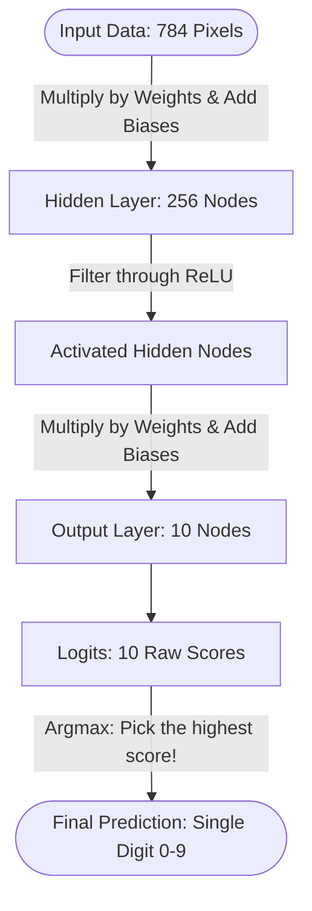
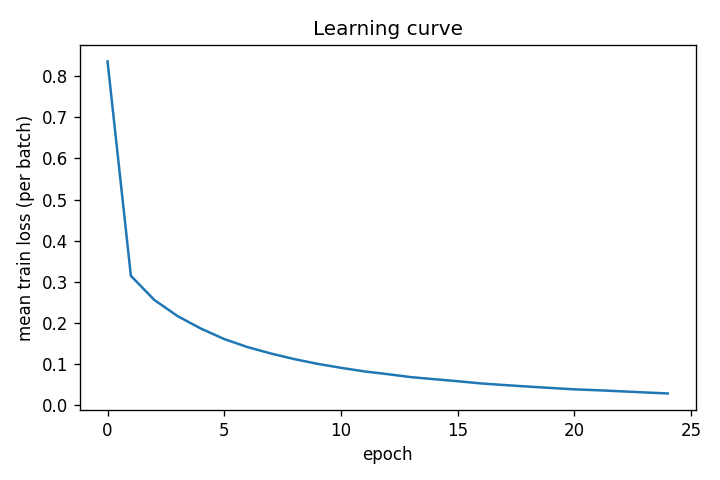

# ECS 170 — Artificial Intelligence — Spring 2026

## Course Project: Stage 2 Report

Team: **BogoSorters**

| Name               | Email                                                       |
| ------------------ | ----------------------------------------------------------- |
| Vijit Dua          | [vijdua@ucdavis.edu](mailto:vijdua@ucdavis.edu)             |
| Pushkal Srivastava | [plsrivastava@ucdavis.edu](mailto:plsrivastava@ucdavis.edu) |

---

## Section 1: Task Description

We have been given a training dataset consisting of labels and features.

The features are a set of 785 images that are a 10-class handwritten images of digits (flattened to 784 grayscale pixels, each pixel has a color intensitity in the range of 0-255 in the file which we have rescaled to 0-1 in the code). This is similar to the MNIST images dataset.

The labels are discrete whole numbers in the range of 0,9 per row.

Our goal is to train a model on this training dataset to identify a digit from a image in the test set on an MLP (Multi layer perceptron) model.

---

## Section 2: Model Description

**Overall idea:** The MLP takes a 784-dimensional vector, passes it through one **hidden** layer with a **ReLU** nonlinearity, then a **final linear** layer that outputs **10 unnormalized scores (logits)**. Training picks the class with the **largest** logit on the test set. The loss is **softmax + cross-entropy** (implemented as `CrossEntropyLoss` on the logits, which is standard for multi-class training).

We use a Standard MLP model with multiple stages:

1. Input

- Take the 784 rescaled pixel values from the flattened image (785 images)

1. Hiden Layer (256 Nodes)

- Connect the 784 pixels to a middle layer of 256 nodes (connected with weights and biases per node, duh).
- Then pass these results through a ReLU activation function
  - We choose ReLU as it introduces non-linearity to the model
  - This helps our chances of the model seperating complex shapes like the loop in a 6, 8, and 9 properly

1. Output Layer

- We convert the 256 signals into 10 final output nodes, we use logits.
- The reason we choose 10 outputs, as we need one output per each digit in the range 0-9 (inclusive).

1. Prediction Layer

- To identify the actual digit, we arg max the 3rd layer to find the most likely digit and return that as our output.

**Architecture (diagram):**

---

## Section 3: Experiment Settings

### 3.1 Dataset Description

- We used a A single project dataset split into two CSV files, `**train.csv` and `**test.csv`, placed under `data/stage_2_data/`.
- Each line has **785** comma-separated integers: `label, f1, …, f784`. The first value is the class; the rest are the features.
- **Partitioning** The partitioning is given by the instructor (not random in our code). We use **all** rows in `train.csv` for **training** and **all** rows in `test.csv` for **evaluation** only. On the run documented below, this yields **60,000** training and **10,000** test examples, each of shape 784 when loaded.
- **Preprocessing** Features are read as integers, cast to `float32`, and **divided by 255** so they lie in the interval **0, 1]** before training (helps optimization stability).

### 3.2 Detailed Experimental Setups

| Item                                | Value                                                                              |
| ----------------------------------- | ---------------------------------------------------------------------------------- |
| **Framework**                       | PyTorch 2.x                                                                        |
| **Depth (trainable linear layers)** | 2: `fc1: 784 → 256`, `fc2: 256 → 10`                                               |
| **Nonlinearity**                    | ReLU after the first layer                                                         |
| **Output**                          | 10 logits (no Softmax in the model; `CrossEntropyLoss` consumes logits)            |
| **Loss**                            | Cross-entropy (multiclass)                                                         |
| **Optimizer**                       | Adam                                                                               |
| **Learning rate**                   | `1e-3`                                                                             |
| **Batch size**                      | 1024                                                                               |
| **Epochs**                          | 25                                                                                 |
| **Hidden width**                    | 256 (see `code/stage_2_code/Method_MLP.py`)                                        |
| **Weight init**                     | PyTorch `nn.Linear` default initialization (no custom init)                        |
| **Randomness**                      | `np.random.seed(2)`, `torch.manual_seed(2)` in `script_mlp.py` for reproducibility |
| **Device**                          | CPU                                                                                |
| **Multiple datasets?**              | N/A — one train/test file pair.                                                    |

To reproduce: from `script/stage_2_script/`, with `PYTHONPATH=../..` and the venv in the repo root (see [requirements.txt](../requirements.txt)), run `python script_mlp.py` (default **`--preset baseline`**) to match the table in Section 3.6. Other **presets** (`hidden_128`, `hidden_512`, `lr_3e4`) re-run the ablations in Section 3.7; see `script/stage_2_script/README.md` for the exact commands.

### 3.3 Evaluation Metrics

- **Accuracy:** Fraction of test examples for which the predicted class equals the true label.
- **Precision, Recall, F1:** For **multiclass** data we do **not** use only a single binary P/R/F1. We use scikit-learn’s `precision_score`, `recall_score`, and `f1_score` with `average=macro | weighted | micro` over the 10 classes.
  - **Macro** averages the metric **per class** and then takes an unweighted mean (classes treated equally).
  - **Weighted** averages per class weighted by class **support** (size in the test set).
  - **Micro** pools all examples and is equivalent to accuracy for multiclass in our setting when counting joint TP/FP/FN in an aggregated way.

### 3.4 Source Code  
[https://github.com/vijitdua/UCD-ECS-170-SQ26-GROUP-PROJECT](https://github.com/vijitdua/UCD-ECS-170-SQ26-GROUP-PROJECT)

Stage 2 code lives under `code/stage_2_code/`, the runnable entry point is `script/stage_2_script/script_mlp.py`, and a short how-to is in `script/stage_2_script/README.md`.

### 3.5 Training Convergence Plot

- **File produced by the code:** for the **baseline** run, `result/stage_2_result/MLP_baseline/learning_curve.png` (the script prints the full path, e.g. `saved learning curve to .../learning_curve.png`). The same figure is duplicated under `reports/assets/` for this write-up so Markdown previews and most PDF tools load it (many block `..` image paths that leave the report directory).
- **X-axis:** Training **epoch** (0 … 24 for 25 epochs in the baseline config).
- **Y-axis:** **Mean training loss** over minibatches in that epoch (CrossEntropy on training batches, averaged for the epoch).

**Plot (baseline, seed 2, same run as Section 3.6):**

**What the plot should show:** A **decreasing** loss (possibly with small step-to-step noise because of minibatch sampling) that **stabilizes** as epochs increase, consistent with **gradient-based** optimization (Adam) minimizing the training loss.

A single pre-partitioned **train**/**test** file pair is used; there is no within-code random split of one CSV.

### 3.6 Model Performance

Numbers below are **test-set** metrics from a single run with **`python script_mlp.py --preset baseline`**, seeds `np.random`/`torch` = 2, same as Section 3.2. (Other model variants for Section 3.7 use the **same** script with different `--preset` values; see `script/stage_2_script/README.md`.)

| Metric                   | Value           |
| ------------------------ | --------------- |
| **Accuracy**             | 0.9784 (97.84%) |
| **Precision (macro)**    | 0.9784          |
| **Recall (macro)**       | 0.9782          |
| **F1 (macro)**           | 0.9783          |
| **Precision (weighted)** | 0.9784          |
| **Recall (weighted)**    | 0.9784          |
| **F1 (weighted)**        | 0.9784          |
| **Precision (micro)**    | 0.9784          |
| **Recall (micro)**       | 0.9784          |
| **F1 (micro)**           | 0.9784          |

### 3.7 Ablation Studies

The handout requires **changing the architecture and/or other parameters** and **comparing** performance. Our **baseline** is the row in Section 3.6. Below is a **template**; **fill in the last column** after re-running the script (same data, same seeds, change only the stated hyperparameter in `code/stage_2_code/Method_MLP.py` and save).

| ID  | What we change                                  | Rationale (one line)                         | Test accuracy | F1 (macro)   |
| --- | ----------------------------------------------- | -------------------------------------------- | ------------- | ------------ |
| A   | *Baseline* — h=256, lr=1e-3, 25 epochs, bs=1024 | reference model                              | 0.9784        | 0.9783       |
| B   | `hidden_dim` **128** (narrower)                 | see if a smaller network still fits the data | 0.9749        | 0.9747       |
| C   | `hidden_dim` **512** (wider)                    | more capacity; may improve or overfit        | 0.9806        | 0.9805       |
| D   | `learning_rate` **3e-4** (lower)                | same depth/width, slower update              | 0.9648        | 0.9645       |

Ablations were run with the same data and seeds, via `--preset hidden_128`, `hidden_512`, and `lr_3e4` (see README).

