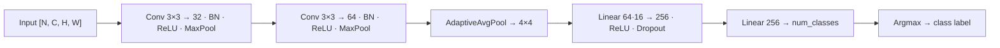
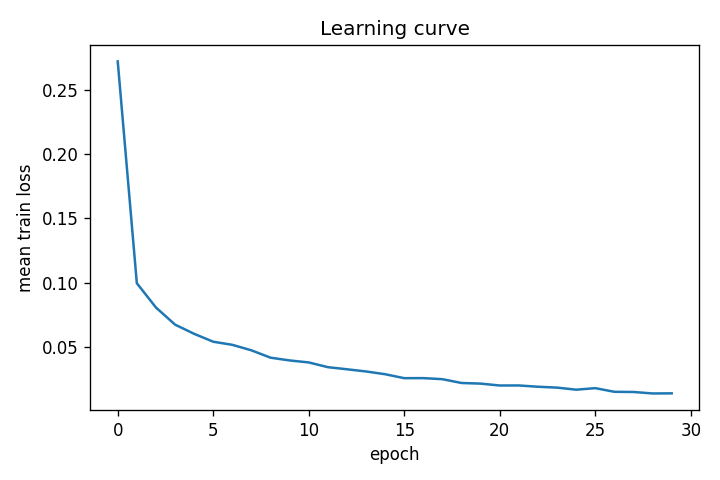
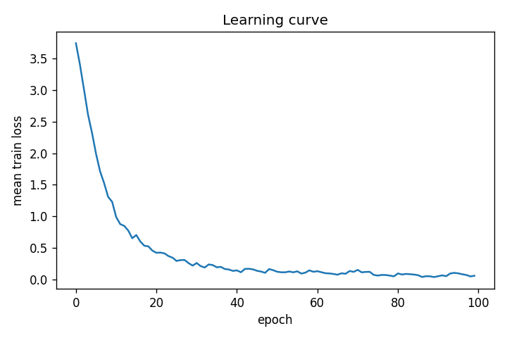
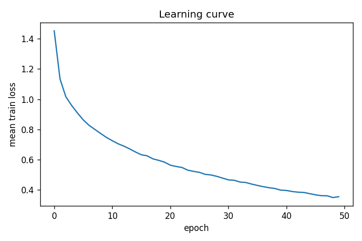

# ECS 170 — Artificial Intelligence — Spring 2026

## Course Project: Stage 3 Report

Team: **Solo — Vijit Dua**

| Name      | Student ID | Email |
| --------- | ---------- | ----- |
| Vijit Dua | *(submitted on Canvas)* | [vijdua@ucdavis.edu](mailto:vijdua@ucdavis.edu) |

---

## Section 1: Task Description

Stage 3 is **image classification** using a **convolutional neural network (CNN)**. We train one CNN per instructor-provided dataset: handwritten digits (**MNIST**, 10 classes), cropped grayscale face images (**ORL**, 40 people), and low-resolution color objects (**CIFAR-10**, 10 classes). Each dataset ships as a binary pickle file with pre-partitioned training and testing lists. The code loads the pickle, converts images to float32 tensors scaled to [0, 1], and trains end-to-end with cross-entropy loss and Adam. At test time, predicted class = argmax of output logits. We report training loss convergence curves and multiclass precision/recall/F1 on the held-out test set.

---

## Section 2: Model Description

We use a single configurable `Method_CNN` class for all three datasets.

**Baseline architecture (2 conv blocks):**

1. **Block 1:** `Conv2d(in_ch → 32, 3×3, pad=1)` → `BatchNorm2d` → `ReLU` → `MaxPool2d(2×2)`
2. **Block 2:** `Conv2d(32 → 64, 3×3, pad=1)` → `BatchNorm2d` → `ReLU` → `MaxPool2d(2×2)`
3. **AdaptiveAvgPool2d(4×4)** — collapses any spatial size to 4×4, allowing all three datasets to share one head
4. **Flatten** → `Linear(64×16 → 256)` → `ReLU` → `Dropout(0.5)` → `Linear(256 → num_classes)`

**Deeper ablation (3 conv blocks):** adds `Conv2d(64 → 128, 3×3, pad=1)` + BN + ReLU + MaxPool after Block 2; the head input becomes `128×16`.

**Training:** CrossEntropyLoss, Adam, `np.random.seed(2)` + `torch.manual_seed(2)` for reproducibility. Device auto-selected: CUDA → Apple Metal (MPS) → CPU.

**Architecture diagram (baseline):**

---

## Section 3: Experiment Settings

### 3.1 Dataset Description

| Dataset | Content | Train | Test | Input shape | Classes |
| ------- | ------- | ----- | ---- | ----------- | ------- |
| **MNIST** | Handwritten digits | 60,000 | 10,000 | 1×28×28 | 10 (digits 0–9) |
| **ORL** | Grayscale face crops | 360 | 40 | 1×112×92 | 40 (one person per class) |
| **CIFAR-10** | Low-res color objects | 50,000 | 10,000 | 3×32×32 | 10 object categories |

Splits are fixed in the instructor-provided pickle files — no random re-splitting. Preprocessing: pixel values divided by 255 (if > 1). ORL is stored as 3-channel RGB-equal grayscale; we use the R channel only.

### 3.2 Detailed Experimental Setups

All runs share: PyTorch 2.11, Adam optimizer, CrossEntropyLoss, Dropout(0.5), default `nn.Conv2d`/`nn.Linear` weight initialization, seeds fixed at 2.

| Setting | MNIST | ORL | CIFAR-10 |
| ------- | ----- | --- | -------- |
| Input channels / classes | 1 / 10 | 1 / 40 | 3 / 10 |
| Epochs | 30 | 100 | 50 |
| Batch size | 64 | 32 | 128 |
| Baseline LR | 1e-3 | 1e-3 | 1e-3 |
| LR ablation | 3e-4 | 3e-4 | 3e-4 |
| Deeper ablation | 3 blocks | 3 blocks | 3 blocks |
| Compute device (this run) | MPS (Apple Metal) | MPS | MPS |

Reproduce with: `PYTHONPATH=. .venv/bin/python -u script/stage_3_script/script_cnn.py --preset all` from repo root. See `script/stage_3_script/README.md` for individual preset commands.

### 3.3 Evaluation Metrics

- **Accuracy:** fraction of test examples correctly classified.
- **Precision / Recall / F1** computed with scikit-learn using three averaging strategies:
  - **Macro** — per-class metric averaged uniformly (treats all classes equally regardless of size).
  - **Weighted** — per-class metric weighted by class support in the test set.
  - **Micro** — globally pooled across all classes (equals accuracy for multiclass single-label tasks).

### 3.4 Source Code

[https://github.com/vijitdua/UCD-ECS-170-SQ26-GROUP-PROJECT](https://github.com/vijitdua/UCD-ECS-170-SQ26-GROUP-PROJECT)

Stage 3 implementation: `code/stage_3_code/` · Entry script: `script/stage_3_script/script_cnn.py` · Dependencies: `requirements.txt`

### 3.5 Training Convergence Plot

X-axis = training epoch; Y-axis = mean cross-entropy loss per epoch (averaged across mini-batches). All three baselines show loss decreasing and levelling off, consistent with gradient descent convergence.

**MNIST baseline (30 epochs, LR=1e-3):**

**ORL baseline (100 epochs, LR=1e-3):**

**CIFAR-10 baseline (50 epochs, LR=1e-3):**

### 3.6 Model Performance

**MNIST (test set — 10,000 examples)**

| Variant | Accuracy | Precision (macro) | Recall (macro) | F1 (macro) |
| ------- | -------- | ----------------- | -------------- | ---------- |
| Baseline (lr=1e-3, 2 blocks) | **0.9929** | 0.9927 | 0.9929 | 0.9928 |
| LR=3e-4 (2 blocks) | 0.9920 | 0.9920 | 0.9919 | 0.9919 |
| Deeper (lr=1e-3, 3 blocks) | **0.9941** | 0.9941 | 0.9940 | 0.9940 |

**ORL (test set — 40 examples)**

| Variant | Accuracy | Precision (macro) | Recall (macro) | F1 (macro) |
| ------- | -------- | ----------------- | -------------- | ---------- |
| Baseline (lr=1e-3, 2 blocks) | 0.9750 | 0.9625 | 0.9750 | 0.9667 |
| LR=3e-4 (2 blocks) | **1.0000** | 1.0000 | 1.0000 | 1.0000 |
| Deeper (lr=1e-3, 3 blocks) | **1.0000** | 1.0000 | 1.0000 | 1.0000 |

**CIFAR-10 (test set — 10,000 examples)**

| Variant | Accuracy | Precision (macro) | Recall (macro) | F1 (macro) |
| ------- | -------- | ----------------- | -------------- | ---------- |
| Baseline (lr=1e-3, 2 blocks) | 0.7588 | 0.7667 | 0.7588 | 0.7560 |
| LR=3e-4 (2 blocks) | 0.7739 | 0.7777 | 0.7739 | 0.7729 |
| Deeper (lr=1e-3, 3 blocks) | **0.7740** | 0.7849 | 0.7740 | 0.7728 |

### 3.7 Ablation Studies

We vary two hyperparameters — **learning rate** (1e-3 vs 3e-4) and **network depth** (2 vs 3 conv blocks) — across all three datasets.

**Summary (F1 macro):**

| Dataset | Baseline (A) | Lower LR (B) | Deeper CNN (C) |
| ------- | ------------ | ------------ | -------------- |
| MNIST | 0.9928 | 0.9919 | **0.9940** |
| ORL | 0.9667 | **1.0000** | **1.0000** |
| CIFAR-10 | 0.7560 | 0.7729 | 0.7728 |

**Learning rate (B vs A):** Lowering LR to 3e-4 helped on **ORL** (0.9667 → 1.0000 F1) and **CIFAR-10** (0.7560 → 0.7729), but slightly hurt **MNIST** (0.9928 → 0.9919). On ORL the slower update allowed more stable convergence on a tiny dataset (360 training samples). On CIFAR, slower updates helped generalization on the harder task. The MNIST baseline already converges well at 1e-3 within 30 epochs, so the slower LR marginally underfit.

**Depth (C vs A):** Adding a third conv block improved all three datasets. **MNIST** gained a small boost (0.9928 → 0.9940) — more capacity helps capture finer digit strokes. **ORL** jumped to 1.0000 — the deeper net learns face-specific features more efficiently from 360 training images. **CIFAR-10** saw essentially the same score as the LR ablation (0.7728 vs 0.7729), suggesting the bottleneck for CIFAR is data complexity rather than model capacity at this scale, and that training loss (which drops much lower for the deeper model: 0.10 vs 0.36) does not translate to proportionally better test accuracy — a sign of some overfitting on training data.
